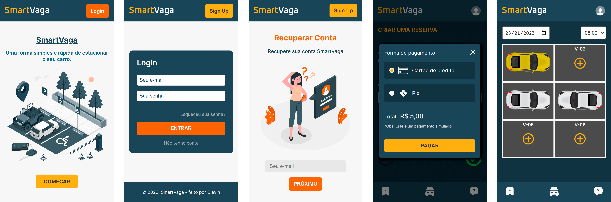

# SmartVaga
>Projeto construído em Next.js

Aplicação Web para consulta e reserva para vagas de estacionamento de carros.

Veja a aplicação em funcionamento aqui: https://smartvaga.vercel.app/

")

## Sobre
Projeto com a finalidade de simular a consulta e locação de vagas de um estacionamento, automatizando alguns processos no controle do mesmo e facilitando também ao motorista. Tudo feito em poucos cliques no celular ou computador. A plataforma foi pensada tanto para mobile quanto para se adaptar ao desktop.

## Features
* Permite ao usuário o cadastro de vários carros.
* Consulta a disponibilidade de vagas em determinado dia e horário.
* Reserva a vaga disponível em poucos cliques.
* Planta do estacionamento para visualização das vagas.
* Seção "Minhas reservas" para acompanhamento do usuário.
* Tag "Reserva expirada" nas reservas vencidas.

## Tecnologias
* Typescript
* Next.js (Front-end)
* Node js (Back-end)
* Typeorm
* Postgres